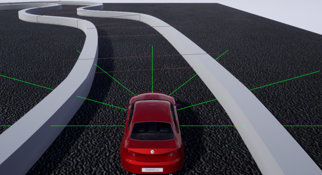
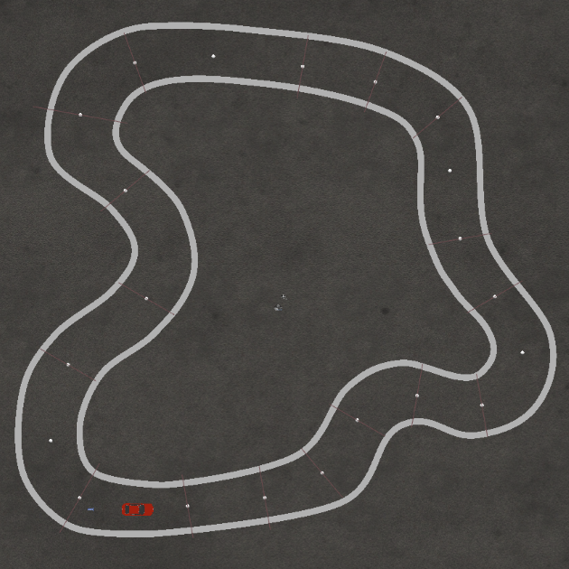

# DeepQLearning_Car
This is a simulation of a self-driving car that can navigate through a predefined track. The car is only given distances to the walls of the track as input, and it has to develop a policy to navigate through the track without collision. We used a variant of Q-Learning (a Reinforcement Learning algorithm) called Deep Q-Network (DQN) to develop the above mentioned policy. 

This project was built with [CUDA v10.1](https://developer.nvidia.com/cuda-10.1-download-archive-base), [libtorch 1.4.0](https://download.pytorch.org/libtorch/cu101/libtorch-shared-with-deps-1.4.0.zip), and Unreal Engine 4.23.1. You can watch the demo of the project running [here](https://youtu.be/OmNfeJuL4x0).

# Getting Started
For Windows
## Prerequisites
* Visual studio 2019
* Unreal Engine 4.23.1
* [CUDA v10.1](https://developer.nvidia.com/cuda-10.1-download-archive-base)
* [libtorch 1.4.0](https://download.pytorch.org/libtorch/cu101/libtorch-shared-with-deps-1.4.0.zip)

## Setup
* Extract and copy your local ```libtorch``` folder into ```Thirdparty/``` folder of this repo.
* Change ```cuda_path``` variable in ```Source/DQN_Car/DQN_Car.Build.cs``` file to the directory containing your local CUDA v10.1 files.
* Right click ```DQN_Car.uproject``` file and generate visual studio files.
* Copy all the .dll files from ```libtorch/lib/``` to ```Binaries/Win64/``` (if you don't see this folder, you may have to build the project first, see the next section)
* Open any source file containing ```#include "torch/torch.h"``` you should see a macro ```THIRD_PARTY_INCLUDES_START```, go to its definition (should be inside ```C:\Program Files\Epic Games\UE_4.23\Engine\Source\Runtime\Core\Public\Windows\WindowsPlatformCompilerPreSetup.h``` file) and add the following in line 116 (or anywhere between the lines ```__pragma(warning(push)) \``` and ```PRAGMA_DISABLE_REORDER_WARNINGS \```):
``` 
__pragma(warning(disable: 4273))\
__pragma(warning(disable: 4582))\
__pragma(warning(disable: 4583))\
__pragma(warning(disable: 4018))\
```

## Run
* Open ```DQN_Car.sln``` file and check to see if the startup project is "DQN_Car" and not "UE4" 
* Build and run (press F5 for Visual Studio)
* If you want to resume the training then set ```g_Resume = true``` in ```Source/DQN_Car/CarGI.cpp```, then build and run

# Project Details
We created the track and the car in Unreal Engine. The car contains 7 sensors and can perform one of 3 actions at a given timestep i.e., move forward, turn left, and turn right. 

Training DQN agents require a reward function. We used the following reward function, 
* The agent receives a reward of −200 if it collides with the wall. 
* If it is critically close to the wall i.e., any one of its sensors outputs a value less than 0.1, the agent receives a reward of −20. 
* For the agent to receive a positive reward, we have added reward gates at various positions of the track. The agent receives an additional reward of +50 every time it passes one of these reward gates.

A complete list of parameters and hyperparameters used in this project is given below,
| Parameters and Hyperparameters | Value  |
|--------------------------------|--------|
| State-space size               | 7      |
| Action-space size              | 3      |
| Hidden layer 1 size            | 16     |
| Hidden layer 2 size            | 16     |
| Hidden layer 3 size            | 8      |
| Discount factor                | 0.95   |
| Learning rate                  | 1e-3   |
| Batch size                     | 128    |
| Capacity                       | 131072 |
| Update Step size               | 36000  |
| epsilon max                    | 0.99   |
| epsilon min                    | 0.01   |
| Decay rate                     | 1e-4   |

* The input layer and the hidden layers use ReLU activation function and the output layer is a Linear function. We used Mean Squared Error (MSE) loss function and Adam optimizer to update the weights using backpropagation. 

# Output
Screenshots of the project.\
Car and position of the sensors (green lines)\


Track (the white dots represent position of the reward gates)\


# ToDo
## Unreal Environment Simulation
- [x] Car Movement
- [x] Track (Default; Training)

## DQN Implementation
- [x] Replay Memory
- [x] Neural network and training interface class
- [x] Epsilon Greedy Strategy and Agent
- [x] Algorithm Implementation
